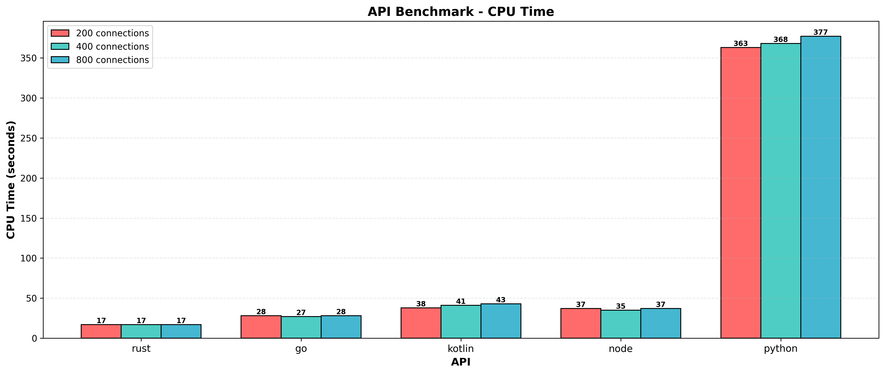
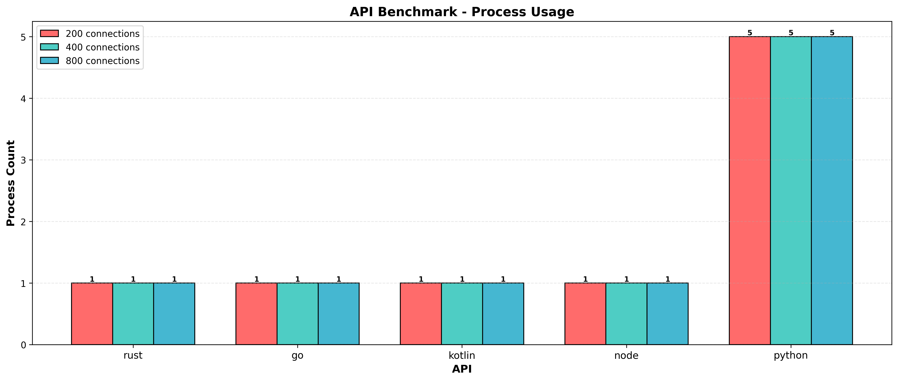

# Latest Results

Timestamp: `Tue Feb 3 11:10:22 UTC 2026`

## Requests Per Second

## Test Duration

## API Memory Usage

## API CPU Time

## P99 Response Time

## API Threads

## API Processes

## Success Rate

---
*Graphs generated from benchmark results. See raw.md for detailed data.*
