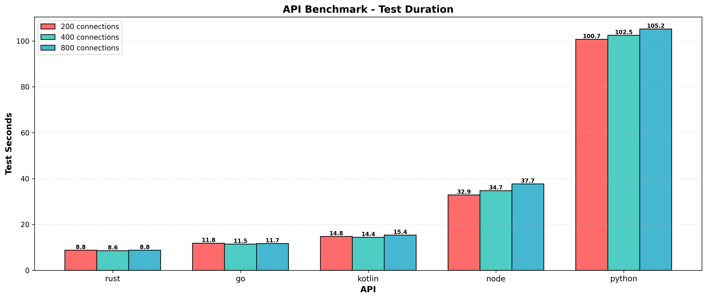
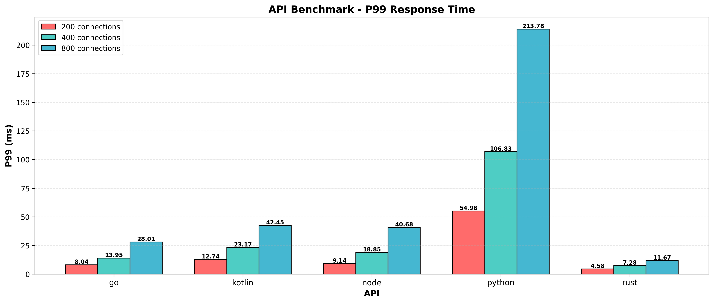
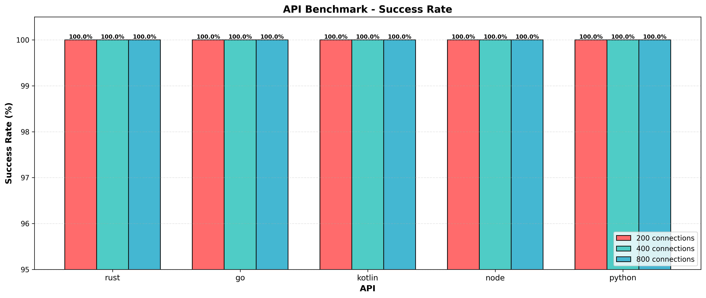

# Latest Results

Timestamp: `Sat Jan 10 11:06:27 UTC 2026`

## Requests Per Second

## Test Duration

## API Memory Usage

## P99 Response Time

## API Threads

## Success Rate

---
*Graphs generated from benchmark results. See raw.md for detailed data.*
